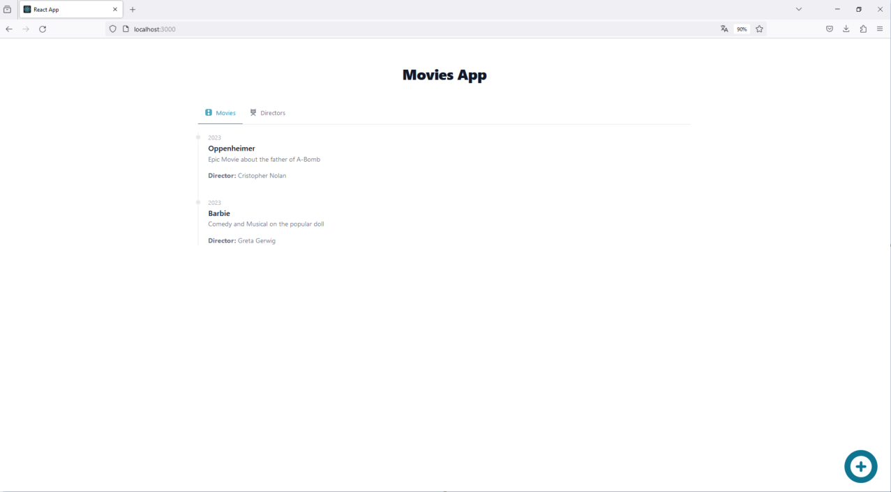

# Preguntas
# Daniela Julio

1.- Revisa el contenido del directorio sql_migrations. ¿Cuál es la diferencia entre los archivos con el verbo Create con los archivos con el verbo Add?
Los Archivos con el verbo Create, tal como lo dice su nombre, crean las tablas en donde se agregaran los datos, los archivos con el verbo Add, insertan los datos (valores) en las tablas creadas.

2.- ¿Qué pasa si cambias el nombre del servicio de postgres a db? ¿Qué otros cambios tendrías que hacer?
Cambiaría la conexión al servidor de la base de datos, tendría que modificar la función connectDb y todas las variables asociadas al servicio postgres en el archivo Docker-compose
en la seccion depends_on.
3.- Si quisieramos que el servicio movies-api use el puerto 81, ¿Qué cambios habría que hacer? 
Se modifica el puerto en el archivo .env, asignándole el valor 81 a la variable BIND_PORT

4.- ¿Qué pasa si a la variable de ambiente `BIND_IP` le asignas el valor localhost?
Podría dejar de comunicarse con otros contenedores, genera vulnerabilidades de seguridad o habría que configurar  o vincular los otros servicios para que accedan al host.

5.- Revisa el archivo `Dockerfile` en la carpeta `movies-api`. ¿Qué te llama la atención? Trata de explicar lo que ocurre en este caso.
La versión de golang está definida como build-stage
Me llama la atención que Las variables de entorno son diferentes según el lenguage en el que se construye dockerfile

