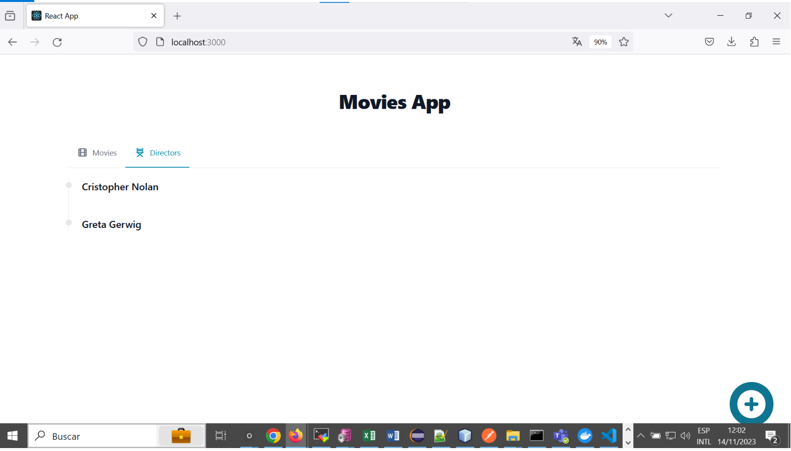

Claudio Alejandro Galleguillos Perez

1.- Revisa el contenido del directorio sql_migrations. ¿Cuál es la diferencia entre los archivos con el verbo Create con los archivos con el verbo Add?

Repuesta: 
Create, permite crear las tablas movies y directors que almacenaran los datos
Add, permite agregar 2 registros a las tablas movies y directors

2.- ¿Qué pasa si cambias el nombre del servicio de postgres a db? ¿Qué otros cambios tendrías que hacer?

Repuesta:
Debería cambiarlo en la variable de entorno POSTGRES_SERVER del archivo .env, y en el depends_on del servicio movies-api y flyway

3.- Si quisieramos que el servicio movies-api use el puerto 81, ¿Qué cambios habría que hacer?

Repuesta:
Modificar la variable de entorno  BIND_PORT del archivo .env

4.- ¿Qué pasa si a la variable de ambiente BIND_IP le asignas el valor localhost?

Repuesta:
Al realizar el cambio se perdio la comunicacion entre movies-front con movies-api, dado que  solo permite la comunicacion del localhost de movies-front y no desde otro host

5.- Revisa el archivo Dockerfile en la carpeta movies-api. ¿Qué te llama la atención? Trata de explicar lo que ocurre en este caso.

Existe un build y un deploy,  el deploy entiendo llama al build en la línea
COPY --from=build-stage /movies-api /movies-api
descarga imagines, dependencias y ejecuta la aplicacion.

imagenes capturas de pantalla

Claudio Alejandro Galleguillos Perez