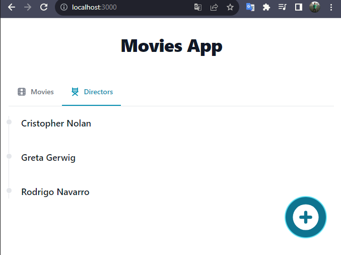

# Respuestas

### Nombre: __Rodrigo Navarro Martínez__

 1.- Revisa el contenido del directorio sql_migrations. ¿Cuál es la diferencia entre los archivos con el verbo Create con los archivos con el verbo Add?

> Los archivos con verbo **Create** crean las tablas en la base de datos, mientras que los archivos con verbo **Add**, insertan información en las tablas creadas anteriormente.

2.- ¿Qué pasa si cambias el nombre del servicio de postgres a db? ¿Qué otros cambios tendrías que hacer?

> Si cambio el nombre del servicio, también debería cambiarlo en la variable de entorno `POSTGRES_SERVER` del archivo `.env`. Sin embargo, en mi caso, no estoy utilizando el nombre del servicio para darle el valor a `POSTGRES_SERVER`, ya que, establecí la propiedad `container_name` en el docker-compose.yml y utilizo ese valor.

3.- Si quisieramos que el servicio movies-api use el puerto 81, ¿Qué cambios habría que hacer? 

> Se debería cambiar solo la propiedad `BIND_PORT` del archivo `.env`, ya que la propiedad `REACT_APP_API_URI` hace referencia a `BIND_PORT`.

4.- ¿Qué pasa si a la variable de ambiente `BIND_IP` le asignas el valor localhost?

> Solo se podría acceder desde el mismo servidor donde esté corriendo la aplicación `movies-api`. Por lo tanto, `movies-front` no podría conectarse al backend.

5.- Revisa el archivo `Dockerfile` en la carpeta `movies-api`. ¿Qué te llama la atención? Trata de explicar lo que ocurre en este caso.

> El Dockerfile de la carpeta `movies-api` cuenta con 2 `FROM` lo que significa que crea 2 imágenes. Por lo tanto, desde el `docker-compose.yml` se agrega la propiedad `target` de la propiedad `build` para apuntar a una imagen del Dockerfile. En este caso, se debe apuntar a la imagen `build-release-stage`, ya que dicha imagen hace el deploy ocupando el build de la imagen `build-stage`.

---

### Capturas de pantalla:

**Movies:**

**Directors:**

---

### Mejoras

1. En las carpetas `movies-api` y `movies-front` se incluye el archivo `.dockerignore`con el proposito de optimizar el proceso de construcción de la imagen, excluyendo aquellos archivos que no son esenciales para la ejecución del contenedor y que están relacionados con el entorno de desarrollo o construcción.

2. En el DockerFile de `movies-front`, en el comando `npm install --quiet` se agrega `--frozen-lockfile` para evitar que se modifique el archivo `package-lock.json` y así optimizar la construcción del contenedor Docker.
